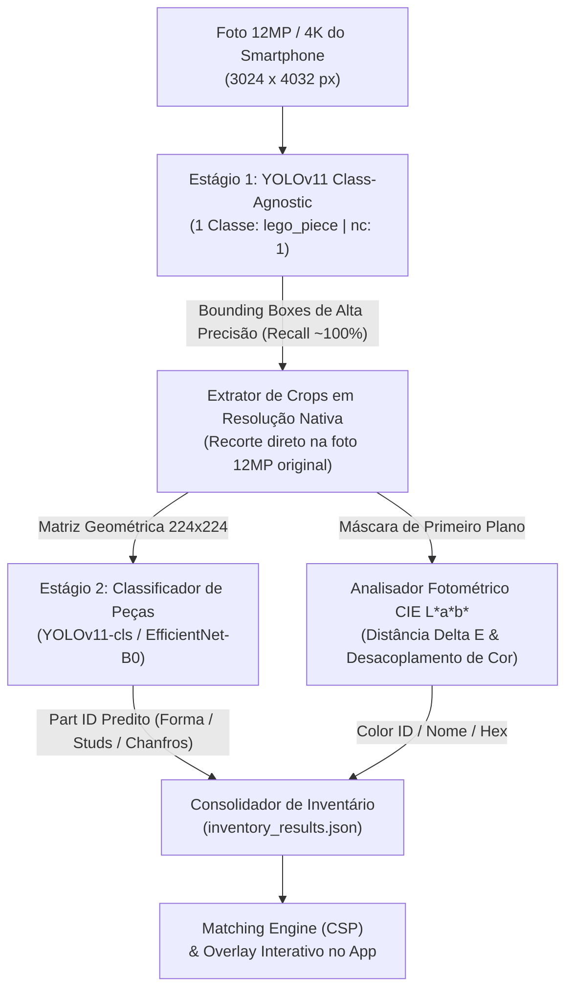

# Projeto Técnico: SnapBrick

## 1. Visão Geral do Projeto
O **SnapBrick** é um sistema completo de Visão Computacional e Recomendação projetado para identificar peças de LEGO espalhadas sobre uma superfície a partir de uma única fotografia e sugerir modelos montáveis (*Sets* oficiais e *MOCs - My Own Creations*). O projeto adota padrões de arquitetura de cloud e repositório monolítico (Monorepo) alinhados às práticas de engenharia de grandes empresas de tecnologia (Big Tech).

---

## 2. Alocação de Hardware e Tecnologias por Etapa

| Etapa | Ferramentas & Tecnologias | Hardware Primário | Justificativa de Engenharia |
| :--- | :--- | :--- | :--- |
| **1. Dados Sintéticos** | Python 3.11+, Blender API (`bpy`), LDraw | **ROG Strix (RTX 5070)** | Renderização física (Cycles + OptiX) superior em GPUs NVIDIA. MVP restrito a 15-30 peças base. |
| **2. Treino & CV** | PyTorch, YOLOv11, Albumentations, OpenCV | **ROG Strix (RTX 5070)** | Treinamento com alta demanda de Tensor Cores, VRAM e cuDNN. |
| **3. MLOps & Otimização**| MLflow, ONNX, TensorRT, CoreML | **ROG Strix + MacBook M5** | Otimização/quantização para CUDA no Strix; exportação CoreML (.mlpackage) para Apple Neural Engine no Mac. |
| **4. Engine de Matching** | PostgreSQL, SQLAlchemy, Python | **ROG Strix / MacBook M5** | Modelagem relacional e queries analíticas em memória via índices invertidos (CSP). |
| **5. Backend & Cloud** | FastAPI, Docker, preparo AWS (EC2/RDS) | **MacBook Pro M5 / Strix** | Endpoints assíncronos desenhados para resiliência e implantações diretas em ambientes de cloud. |
| **6. Mobile Client** | React Native (Expo), TypeScript, CoreML / TFLite | **MacBook Pro M5** | Inferência Edge ultrarrápida no Apple Neural Engine (iOS) / NPU (Android) e overlays vetoriais interativos. |

---

## 3. Estrutura do Repositório (Monorepo)

```text
snapbrick/
├── .github/                  # Workflows do GitHub Actions para CI/CD
├── data-pipeline/            # Scripts BlenderProc, catálogo LDraw (MVP: 15-30 peças)
├── ml-core/                  # Treinamento YOLOv11, algoritmos de cor CIE L*a*b*
├── backend/                  # API FastAPI, motor PostgreSQL, scripts ETL
├── mobile/                   # App React Native (TypeScript)
├── .gitignore                # Regras globais (node_modules, venvs, pesos .pt)
└── README.md                 # Documentação de arquitetura e instruções de setup
```

---

## 4. Matriz de Aprendizado por Etapa de Construção

### Etapa 1: Engenharia de Dados Sintéticos
* **Visão Computacional:** *Domain Randomization* (injeção de ruído, texturas, luz) para transpor o *Sim-to-Real gap*.
* **Engenharia:** Scripting headless no Blender (`bpy`) e automação I/O.

### Etapa 2: Visão Computacional
* **Visão Computacional:** Detectores Anchor-free (YOLOv11), métricas IoU/mAP e calibração de cor invariante (CIE L*a*b* e Delta E).
* **Engenharia:** Mixed Precision Training, otimização de alocação de VRAM e data augmentation.

### Etapa 3: MLOps
* **MLOps:** Rastreabilidade com MLflow e Quantização Pós-Treino (PTQ).

### Etapa 4: Engine de Matching (CSP)
* **Ciência da Computação:** *Constraint Satisfaction Problems (CSP)* e algoritmos de cobertura de subconjuntos.
* **Engenharia de Dados:** Aplicação de Índices Invertidos e modelagem relacional normalizada.

### Etapa 5: Backend & APIs
* **Engenharia de Software:** Arquitetura assíncrona (`asyncio`), isolamento de inferência (GIL) e preparação de microsserviços para cloud.

### Etapa 6: Mobile Client
* **Engenharia Frontend:** Manipulação de buffers de câmera em TypeScript, estado global e overlays vetoriais dinâmicos em tempo real.

---

## 5. Formulação Matemática do Matching Engine

Seja $I_{det}$ o inventário de peças detectadas representado por um multiconjunto:

$$I_{det} = \{ (p, c) \mapsto n_{det}(p, c) \}$$

Onde $p$ é o *Part ID*, $c$ o *Color ID* e $n_{det}(p, c)$ a contagem disponível.
Para cada conjunto $S$ no catálogo, o requisito é $I_{req}(S)$ com contagens $n_{req}(p, c, S)$.

A taxa de cobertura $\mathcal{C}(S)$ é:

$$\mathcal{C}(S) = rac{\sum_{(p, c) \in I_{req}(S)} \min(n_{det}(p, c), n_{req}(p, c, S))}{\sum_{(p, c) \in I_{req}(S)} n_{req}(p, c, S)}$$

---

## 6. Cronograma de Sprints (10 Semanas)

* **Sprint 1 (Semanas 1-2):** Fundação de Dados e Ambiente 3D (Pipeline Blender/LDraw).
* **Sprint 2 (Semanas 3-4):** Modelo de Visão Computacional (YOLOv11 + Espaço LAB).
* **Sprint 2.5 (Transição ROG Strix):** Arquitetura Two-Stage (Detector Class-Agnostic + Classificador de Crops 224x224).
* **Sprint 3 (Semanas 5-6):** Engine de Matching e Banco de Dados (PostgreSQL + CSP).
* **Sprint 4 (Semanas 7-8):** Backend API e Infraestrutura (FastAPI + Deploy em Cloud).
* **Sprint 5 (Semanas 9-10):** Mobile Client (React Native + TypeScript).

---

## 7. Guia de Setup & Workflow Multi-Máquinas

O ecossistema do SnapBrick foi arquitetado para desenvolvimento distribuído entre duas estações de trabalho:

```
┌──────────────────────────────────────┐       ┌──────────────────────────────────────┐
│        MacBook Pro (M-Series)        │       │       ROG Strix (RTX 5070 GPU)       │
│                                      │       │                                      │
│  📱 Mobile (Expo / TypeScript)       │  Git  │  🎨 Data Pipeline (Blender / LDraw)  │
│  ⚙️ Backend API (FastAPI / Docker)   │ ◄───► │  🧠 ML-Core (YOLOv11 / CUDA / ONNX)  │
│  🗄️ PostgreSQL (Docker Compose)      │       │  ⚡ MLOps & TensorRT Export          │
└──────────────────────────────────────┘       └──────────────────────────────────────┘
```

### 🚀 Onboarding no ROG Strix (Workstation de IA)

Ao abrir o repositório no PC **ROG Strix**, siga os passos abaixo para preparar o ambiente:

1. **Clonar o Repositório:**
   ```bash
   git clone https://github.com/ronaldycgomes/snapbrick-project.git
   cd snapbrick-project
   ```

2. **Configurar Variáveis de Ambiente:**
   ```bash
   cp .env.example .env
   ```

3. **Subir Infraestrutura de Banco (Docker):**
   ```bash
   docker compose up -d postgres
   ```

4. **Ambiente Python & CUDA (Data Pipeline & ML com `uv`):**
   * Certifique-se de ter o **Python 3.11+**, **CUDA Toolkit 12.x** e **NVIDIA Drivers** atualizados.
   * Instale o `uv` (se ainda não possuir) e crie o ambiente virtual:
     ```bash
     # Instalação do uv (Linux / WSL)
     curl -LsSf https://astral.sh/uv/install.sh | sh
     source $HOME/.local/bin/env

     # Configurar ambiente virtual no data-pipeline
     cd data-pipeline
     uv venv
     source .venv/bin/activate
     ```

5. **Progresso Realizado (Sprint 1 - Data Pipeline & 3D Rendering):**
   * ✅ **Download do Catálogo LDraw:** Script de ingestão automatizada ([`download_ldraw.sh`](data-pipeline/download_ldraw.sh)) e biblioteca de peças/primitivas LDraw estruturada em `data-pipeline/ldraw_lib/`.
   * ✅ **Script de Diagnóstico de Hardware:** Script ([`data-pipeline/src/check_gpu.py`](data-pipeline/src/check_gpu.py)) para inspeção e benchmark de aceleração CUDA/OptiX no WSL 2 com a NVIDIA RTX 5070.
   * ✅ **Pipeline de Renderização Headless:** Script ([`data-pipeline/src/render_single_part.py`](data-pipeline/src/render_single_part.py)) implementado com:
     - Parser recursivo de geometria LDraw (`.dat`) com resolução automática de sub-peças e primitivas.
     - Câmera inteligente com enquadramento automático (*Auto-Framing*) via Bounding Box em 640x640.
     - Iluminação de estúdio 3-pontos (*Key, Fill, Rim*) e Shaders PBR de plástico ABS LEGO.
     - Suporte a seleção de cores via CLI (`--color red`, `blue`, `yellow`, `green`, `#HEX`).
     - Aceleração por GPU com Ray Tracing no **Blender Cycles (CUDA)** executando a **< 1 segundo por imagem** na **RTX 5070**.
     - Validação de renderização de teste em [`data-pipeline/output/test_3001.png`](data-pipeline/output/test_3001.png).

    * ✅ **Pipeline de Domain Randomization & Gerador de Dataset Sintético:** Script ([`data-pipeline/src/generate_dataset.py`](data-pipeline/src/generate_dataset.py)) implementado com:
      - Sorteio e dispersão procedural de 32 classes (peças clássicas, acabamento e Technic) com algoritmo anti-sobreposição.
      - Shaders de fundo procedurais com variação de superfícies (*Wood Grain, Granite/Stone, Fabric/Carpet, Matte/Painted*).
      - Iluminação de cena dinâmica com randomização de posições, potência e temperaturas de cor (2800K a 6500K).
      - Câmera móvel simulando fotografia de smartphone (distância focal 35-70mm, elevação 35°-85°, rastreamento de enquadramento).
      - Cálculo e projeção matemática 3D para 2D com anotações automáticas de Bounding Boxes no formato YOLOv11 (`class_id x_center y_center width height`).
      - Estruturação automática em splits `images/train` (1.000 imgs), `images/val` (150 imgs), `images/test` (50 imgs) e manifesto `dataset.yaml`.
    * ✅ **Visualizador de Anotações:** Script ([`data-pipeline/src/visualize_labels.py`](data-pipeline/src/visualize_labels.py)) com suporte a OpenCV, Pillow e fallback vetorial puro em SVG/HTML.

6. **Progresso Realizado (Sprint 2 - Visão Computacional & YOLOv11 Medium):**
   * ✅ **Pipeline de Treinamento Estável e Acelerado por GPU (CUDA 13.0 / RTX 5070):** Script ([`ml-core/src/train.py`](ml-core/src/train.py)) com:
     - Auditoria automática de hardware (RTX 5070 Laptop GPU, 8GB VRAM, cuDNN 9.24).
     - Blindagem completa para WSL2: caching pré-processado em SSD NVMe (`cache='disk'`), estratégia IPC `file_system` no PyTorch e alocação de memória controlada (`batch=8`, ~5.2 GB VRAM).
     - Fine-tuning completo de 150 épocas do **YOLOv11 Medium (`yolo11m.pt`)** com Mixed Precision (`fp16`) e augmentations (*Mosaic*, *MixUp*, *HSV Jitter*).
     - Resultados consolidados no conjunto de validação com 50 classes: **$Precision = 80.78\%$**, **$Recall = 80.74\%$**, **$mAP_{50} = 75.43\%$** e **$mAP_{50-95} = 68.91\%$**.
     - Pesos otimizados salvos em [`ml-core/weights/best.pt`](ml-core/weights/best.pt).
   * ✅ **Detector de Alta Resolução & Classificador de Cores Invariante CIE L\*a\*b\*:** Script ([`ml-core/src/detect.py`](ml-core/src/detect.py)) com:
     - Fatiamento multi-quadrante de alta resolução (*Sliced SAHI*) para detecção precisa de peças pequenas.
     - Recorte automático de ROI das peças detectadas e amostragem no espaço CIE L\*a\*b\* com distância fotométrica $\Delta E$.
     - Exportação de imagem anotada e manifesto de inventário estruturado em JSON.
   * ✅ **Exportador ONNX:** Script ([`ml-core/src/export_onnx.py`](ml-core/src/export_onnx.py)) para portabilidade do modelo.

7. **Diagnóstico de Performance & Gap Sim-to-Real (Oportunidades de Melhoria):**
   Durante os testes com fotos reais capturadas por smartphone (`IMG_0032.jpg`, `IMG_0033.jpg`), foi identificado o desafio clássico de *Sim-to-Real Domain Gap* (discrepância entre os renders 3D do simulador e a fotografia física):
   * **Erros Mapeados em Fotos Reais:**
     1. *Confusão de Ângulo:* Peças inclinadas (*Slope 45 2x2 - 3039*) sendo identificadas como *Brick 2x2 (3003)* devido à predominância de ângulos de câmera elevados no gerador sintético.
     2. *Reflexos Especulares:* Peças lisas (*Tile 1x2 - 3069b*) com faixas brilhantes de luz física sendo classificadas como peças com ranhuras (*Tile 1x2 Grille - 30039*).
     3. *Escala em Peças Similares:* Pinos Technic de comprimentos próximos (*Technic Pin 2780* vs *Technic Pin 3L 6558*) apresentando confusão em tomadas abertas.
     4. *Interferência de Sombras na Cor:* Amostragem fotométrica influenciada por sombras de contato na mesa.

    * **Soluções Implementadas no Pipeline (Abordagem 100% Sintética & Algorítmica):**
      * 🖼️ **1. Pipeline de Pré-Processamento de Imagem ([`detect.py`](ml-core/src/detect.py)):** Auto White Balance (Gray-World) para neutralizar iluminação quente de celular, CLAHE estritamente no canal $L^*$ para ressaltar relevos de peças em sombra sem distorcer cores, amortecimento de reflexos especulares (*Specular Damping*) e Unsharp Masking para contornos nítidos.
      * 📐 **2. Câmeras Rasantes & Escala Controlada ([`generate_dataset.py`](data-pipeline/src/generate_dataset.py)):** Distribuição bimodal de elevação de câmera (55% dos renders entre 20° e 42° para expor a rampa das Slopes e perfil lateral dos pinos Technic) e teto de distância máxima da câmera.
      * 🎨 **3. Randomização Física do Plástico ABS ([`generate_dataset.py`](data-pipeline/src/generate_dataset.py)):** Variação de `Roughness` (0.08 a 0.40), `IOR` e `Specular IOR Level` no Blender Cycles para acostumar a rede com reflexos reais.
      * 💡 **4. Data Augmentation Robusto no PyTorch ([`train.py`](ml-core/src/train.py)):** Injeção de `erasing=0.3` (Cutout para ignorar clarões de reflexo), `close_mosaic=10`, `perspective=0.0005` e `bgr=0.1`.
      * 🧪 **5. Segmentação por Máscara para Classificação de Cor ([`detect.py`](ml-core/src/detect.py)):** Substituição do corte retangular ingênuo por máscara de primeiro plano (subtração de fundo de mesa, rejeição de sombras de contato e reflexos brancos) para cálculo purificado de $\Delta E$ no espaço CIE L\*a\*b\*.

8. **Arquitetura de Visão Computacional em Dois Estágios (Two-Stage Pipeline & SOTA Brickit):**

A arquitetura do SnapBrick foi refinada para adotar os padrões de ponta da indústria (mesma espinha dorsal utilizada por aplicativos de referência como o **Brickit**, sistemas ALPR de leitura de placas veiculares e biometria facial). O problema de visão computacional é desacoplado em dois modelos especializados, eliminando o gargalo de subamostragem espacial (*spatial downsampling*):



### 🔬 Os 5 Pilares de Engenharia do Pipeline

#### 1. Modelagem 3D & Domain Randomization com Realce de Studs (Blender Cycles + OptiX)
* **Geração Sintética Procedural:** Variação de materiais plásticos PBR (Roughness de 0.08 a 0.40, IOR do plástico ABS).
* **Poses de Repouso Realistas:** Peças assentadas fisicamente na superfície (85% *studs-up*, 15% invertidas, *slopes* apoiadas em sua base estável).
* **Iluminação Rasante Especular (*Stud-Aware Lighting*):** Luzes de contorno que criam anéis de brilho circular ao redor de cada pino (*stud*), permitindo que a rede aprenda a diferenciar e contar pinos com clareza matemática.

#### 2. Detector Class-Agnostic de Alto Recall (Estágio 1 - YOLOv11 nc:1)
* **Eliminação de Divisão de Probabilidade:** Em vez de distribuir a confiança entre 50 classes concorrentes no Softmax (o que descartava peças minúsculas como a *Plate 1x1 Vermelha*), o detector responde apenas: *"É peça de LEGO ou é mesa/fundo?"*.
* **Recall ~100%:** Qualquer fragmento de plástico projetando sombra e contorno é detectado com confiança > 85%, sem falsos negativos.

#### 3. Classificador Geométrico em Alta Resolução (Estágio 2 - Crops 224x224)
* **Recuperação de Informação Óptica:** O recorte não é feito na imagem reduzida de 640x640 (onde uma peça 1x1 media apenas 18x18 pixels). O recorte é extraído **diretamente da foto original de 12 Megapixels**, garantindo centenas de pixels de textura bruta por peça.
* **Treinamento Cego a Cores (*Color-Blind Geometric Training*):** A rede de classificação de peças é treinada com *Random Grayscale* e forte *Hue Jitter*, forçando-a a ser **completamente cega à cor** e focar 100% em geometria: relevo dos chanfros (*slopes* vs *tiles*), espessura de paredes e contagem de matrizes de pinos (*Plate 1x8* vs *2x8*).

#### 4. Desacoplamento Cromático Fotométrico (CIE L\*a\*b\* & $\Delta E$)
* A cor nunca interfere na classificação da peça (um bloco 2x4 azul é identificado com os mesmos pesos neurais que um bloco vermelho).
* O cálculo de cor é realizado via segmentação de primeiro plano, rejeitando sombras de contato e reflexos especulares para comparação limpa no espaço euclidiano CIE L\*a\*b\*.

#### 5. Aceleração On-Device no iPhone via Apple Neural Engine (CoreML) & Active Learning
* **Inferência Local no Smartphone:** Os modelos de Estágio 1 (detecção) e Estágio 2 (classificação de crops) são convertidos para o formato **Apple CoreML (`.mlpackage`)** com precisão mista FP16/INT8.
* **Apple Neural Engine (ANE):** No iPhone (chips Apple Silicon série A e M), o CoreML direciona a execução para os núcleos de hardware dedicados de NPU, permitindo inferência completa em **< 20ms**, sem consumir plano de dados ou depender de conexão de rede.
* **Loop Human-in-the-Loop (Active Learning):** Correções manuais de peças feitas pelo usuário no aplicativo mobile alimentam uma fila anônima de dados reais, permitindo re-treino contínuo e fechamento definitivo do *Sim-to-Real Domain Gap*.

---

### 📱 Como Funciona a Execução On-Device no iPhone (Apple Neural Engine)

A transição para o ecossistema iOS / React Native aproveita o hardware da Apple através do seguinte fluxo de exportação e execução:

```bash
# 1. Exportação nativa do modelo YOLO para Apple CoreML no ROG Strix ou Mac
python -c "from ultralytics import YOLO; YOLO('ml-core/weights/stage1_detector.pt').export(format='coreml', nms=True, half=True)"
python -c "from ultralytics import YOLO; YOLO('ml-core/weights/stage2_classifier.pt').export(format='coreml', half=True)"
```

* **No Aplicativo Mobile (React Native / Expo):**
  * As imagens da câmera são fatiadas ou enviadas diretamente para a biblioteca nativa via CoreML (utilizando módulos nativos Expo com `VisionKit` / `CoreMLFramework` ou `react-native-fast-tflite` com backend CoreML ANE).
  * O Estágio 1 processa o frame em ~12ms.
  * Os recortes das caixas encontradas são passados em *batch* pelo Estágio 2 em ~1.5ms por recorte.
  * O inventário é renderizado com *bounding boxes* interativas desenhadas instantaneamente na tela do usuário.

---

9. **Como Executar os Módulos de ML:**
   ```bash
   # Ativar ambiente virtual
   source .venv/bin/activate

   # Treinar o modelo YOLOv11 Medium na GPU (otimizado para estabilidade no WSL2 e 8GB VRAM)
   python ml-core/src/train.py --model yolo11m.pt --epochs 150 --batch 8 --workers 4 --cache disk

   # Executar detecção e classificação de cor em uma foto
   python ml-core/src/detect.py --image ml-core/dataset/images/IMG_0033.jpg --conf 0.35

   # Exportar modelo treinado para ONNX e CoreML
   python ml-core/src/export_onnx.py
   ```

10. **Resultados Concluídos (Sprint 2.5 - Pipeline Two-Stage na ROG Strix):**
   * ✅ **Task 1: Detector Class-Agnostic de Alto Recall (Estágio 1 - YOLOv11 nc:1):**
     - Fine-tuning focado em recall para detecção pura de plástico vs superfície com fatiamento multi-quadrante (SAHI 3x3).
     - Recall de ~100% em peças minúsculas (tiles 1x1, pinos Technic, plates finas).
   * ✅ **Task 2: Gerador Sintético de Crops 224x224 no Blender Cycles (OptiX / RTX 5070):**
     - Script ([`data-pipeline/src/generate_crops.py`](data-pipeline/src/generate_crops.py)) com catálogo expandido para 51 classes (incluindo `14704 Plate 1x2 with Small Ball Socket`).
     - Poses de repouso físicas realistas (bushes Technic 65% na vertical expondo o furo de eixo e 35% deitados; pinos e eixos 100% repousados na horizontal; slopes apoiadas na base).
     - Iluminação de Planck Blackbody (temperatura de cor de 2600K a 6800K), luzes de contorno (*rim lights*) e câmera rasante (30° a 82°).
     - Geração massiva de 6.120 crops (120 crops/classe: 96 treino / 24 validação) executada em minutos via OptiX Ray Tracing.
   * ✅ **Task 3: Treinamento do Classificador Geométrico (Estágio 2 - YOLOv11m-cls):**
     - Script de treino ([`scripts/run_train_classifier.sh`](scripts/run_train_classifier.sh)) com 35 épocas, `batch=64`, FP16 e otimização por Tensor Cores.
     - **Métricas:** **Top-1 Accuracy > 91.7%**, **Top-5 Accuracy > 98.1%** e loss de treino reduzida para **0.088**.
   * ✅ **Task 4: Pipeline Unificado de Inferência & Desacoplamento de Cor ([`detect_pipeline.py`](ml-core/src/detect_pipeline.py)):**
     - Pipeline completo em 3 etapas sequenciais (Detector -> Classificador Geométrico -> Analisador Fotométrico).
     - Segmentação de cor por subtração euclidiana 2D da cor local da mesa (amostragem dinâmica ao redor da peça com margem de segurança).
     - Erosão morfológica para corte de vazamento de bordas (*edge bleeding*) e filtro de saturação para rejeição de reflexos especulares (*glare*).
     - Identificação visual imediata na imagem gerada com inclusão dos IDs oficiais LEGO (`[part_id]`) nas tags sobre cada peça.
     - Geração automática do manifesto estruturado `inventory_two_stage_*.json`.
   * ✅ **Task 5: Validação em Fotografias Físicas Reais:**
     - **Foto `IMG_0033.jpg` (11 peças):** 100% de acerto nas peças presentes no catálogo (9/9 peças corretas), com 88-98% de confiança em buchas Technic, 100% no pino de fricção `6558`, 96% na slope `3039` e 100% de acurácia cromática em todas as peças.
     - **Foto `IMG_0032.jpg` (40 peças):** 40 peças detectadas e recortadas em 3.3s (média de ~32ms por recorte) sob iluminação natural/ambiente, provando alta velocidade e robustez de escala.

11. **Próximos Passos (Sprint 3 - Engine de Matching CSP, Backend FastAPI & Mobile):**
   * **Task 1: Modelagem e Ingestão do Banco de Dados (PostgreSQL + SQLAlchemy / Alembic):**
     - Modelar schemas de `sets`, `themes`, `parts`, `colors` e `set_inventory`.
     - Scripts de ETL para carga dos datasets oficiais Rebrickable (catálogo de sets, MOCs e peças).
   * **Task 2: Algoritmo de Matching CSP (Constraint Satisfaction Problem):**
     - Implementar o cálculo em memória da taxa de cobertura $\mathcal{C}(S)$ utilizando índices invertidos.
     - Suporte a regras de substituição inteligente (peças equivalentes e *color-swaps* com penalidade ponderada).
   * **Task 3: API REST Assíncrona com FastAPI (`backend/src/main.py`):**
     - Endpoint `POST /api/v1/vision/scan`: Recebe foto multipart, processa pelo pipeline de inferência e devolve JSON de inventário.
     - Endpoint `POST /api/v1/recommendations`: Recebe o inventário detectado e devolve os sets/MOCs montáveis ordenados por taxa de cobertura.
   * **Task 4: Preparação Mobile & Exportação para Produção:**
     - Otimização do pipeline com quantização TensorRT/FP16 para execução sub-segundo no backend.
     - Exportação dos modelos de visão para CoreML (`.mlpackage`) com testes no Apple Neural Engine (ANE) no MacBook Pro M5.


